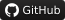
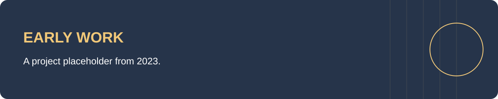

# Final Project

An early project placeholder created in April 2023. The repository currently contains only this README; no implementation, project brief, or results are available to review.

There is no application to run. This repository is retained as part of my learning history.

---

## Author

**Kenneth Yeaher**  
BS in Information Science  
University of Maryland, College Park  

`Learning Archive`
