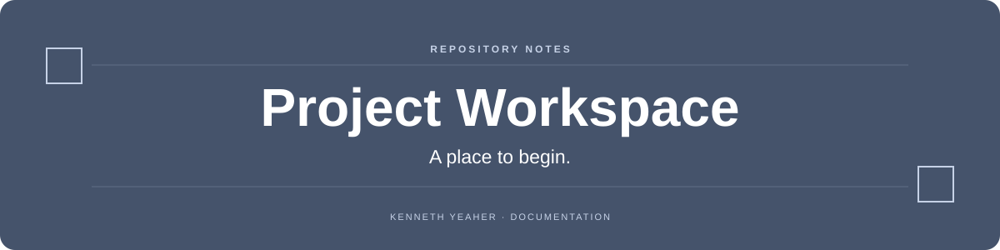

  

  

## Overview

A reserved project repository. The current tree contains a README only; no application, dataset, or runnable implementation is checked in.

## At a glance

| Area | What to look for |
| --- | --- |
| **Current contents** | Repository documentation. |
| **Status** | Project scope and implementation have not yet been added. |

## Start here

There is nothing to install or run yet.

## Scope

This repository is a workspace placeholder rather than a completed portfolio project.
